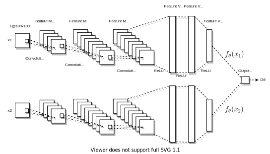

### One-Shot Recognition of Manufacturing Defects in Steel Surfaces

This repository contains the codes for the paper:  
**Deshpande, A. M., Minai, A. A., & Kumar, M. (2020). One-Shot Recognition of Manufacturing Defects in Steel Surfaces.** [[arxiv](https://arxiv.org/abs/2005.05815)] [[paper](https://doi.org/10.1016/j.promfg.2020.05.146)]


### Network Architecture



### Requirements
```
numpy
scipy
matplotlib
torch
torchvision
scikit-learn
imutils
opencv-python
Pillow
jupyterlab
```

##### Do the following in given order to install all the packages

Create a python virtual environment, preferrablely using [Anaconda](https://www.anaconda.com/products/individual/get-started).  
Download anaconda and install from [here](https://www.anaconda.com/products/individual/get-started).  
To create the virtual environment, open terminal (anaconda prompt) and execute:
```
conda create -n steel_p36 python=3.6
```

Activate python environment in your terminal:
```
conda activate steel_p36
```

Run the following commands in your terminal to install all the dependencies.
```
pip install numpy scipy matplotlib
pip install jupyterlab
pip install Pillow
pip install opencv-contrib-python
pip install -U scikit-learn
pip install torch torchvision
```

## Dataset
You can get the dataset from the following website:

* NEU Steel Surface defect dataset [1]: [website](http://faculty.neu.edu.cn/yunhyan/NEU_surface_defect_database.html)

Sometimes, I have noticed that the server of this website is down and it cannot be reached.

In that case you can download the dataset from the following link directly:
* NEU surface defect database: [Google Drive](https://drive.google.com/open?id=0B5OUtBsSxu1Bdjh4dk1SeGYtNFU)

## Citation

If you use the code provided in this repository, please cite this work as follows:
```
@article{deshpande20201064,
title={{One-Shot Recognition of Manufacturing Defects in Steel Surfaces}},
journal= {Procedia Manufacturing},
volume= {48},
pages= {1064 - 1071},
year= {2020},
note= {48th SME North American Manufacturing Research Conference, NAMRC 48},
issn= {2351-9789},
doi= {https://doi.org/10.1016/j.promfg.2020.05.146},
url= {http://www.sciencedirect.com/science/article/pii/S2351978920315985},
author= {Aditya M. Deshpande and Ali A. Minai and Manish Kumar},
keywords= {Computer Vision, Deep Learning, Metallic Surface, Convolutional Neural Network, Defect Detection, One-shot recognition, Industrial Internet of Things, Cyber-physical systems, Siamese neural network, Few-shot learning},
}
```

### References and credits
* Song, K., & Yan, Y. (2013). A noise robust method based on completed local binary patterns for hot-rolled steel strip surface defects. Applied Surface Science, 285, 858-864.
