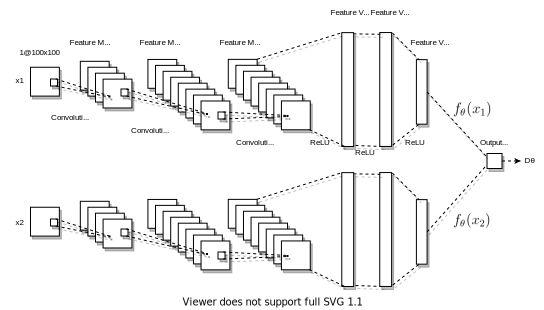

**Deshpande, A. M., Minai, A. A., & Kumar, M. (2020). One-Shot Recognition of Manufacturing Defects in Steel Surfaces.** [[arxiv](https://arxiv.org/abs/2005.05815)] [[paper](https://doi.org/10.1016/j.promfg.2020.05.146)] [[website](https://adipandas.github.io/one-shot-steel-surfaces/)] [[code](https://github.com/adipandas/one-shot-steel-surfaces)]

### Abstract

<p align=" justify">
Quality control is an essential process in manufacturing to make the product defect-free as well as to meet customer needs. The automation of this process is important to maintain high quality along with the high manufacturing throughput. With recent developments in deep learning and computer vision technologies, it has become possible to detect various features from the images with near-human accuracy. However, many of these approaches are data intensive. Training and deployment of such a system on manufacturing floors may become expensive and time-consuming. The need for large amounts of training data is one of the limitations of the applicability of these approaches in real-world manufacturing systems. In this work, we propose the application of a Siamese convolutional neural network to do one-shot recognition for such a task. Our results demonstrate how one-shot learning can be used in quality control of steel by identification of defects on the steel surface. This method can significantly reduce the requirements of training data and can also be run in real-time.
</p>


### Network Architecture and Training Loss curve
<p>


</p>

### Citation

If you find the code provided in this repository useful in your work, please cite it as:
```
@article{deshpande20201064,
title={{One-Shot Recognition of Manufacturing Defects in Steel Surfaces}},
journal= {Procedia Manufacturing},
volume= {48},
pages= {1064 - 1071},
year= {2020},
note= {48th SME North American Manufacturing Research Conference, NAMRC 48},
issn= {2351-9789},
doi= {https://doi.org/10.1016/j.promfg.2020.05.146},
url= {http://www.sciencedirect.com/science/article/pii/S2351978920315985},
author= {Aditya M. Deshpande and Ali A. Minai and Manish Kumar},
keywords= {Computer Vision, Deep Learning, Metallic Surface, Convolutional Neural Network, Defect Detection, One-shot recognition, Industrial Internet of Things, Cyber-physical systems, Siamese neural network, Few-shot learning},
}
```
